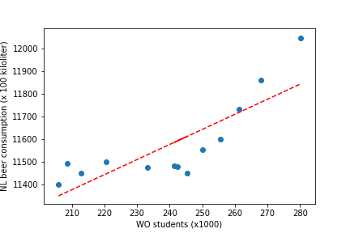

# Assignment Tools in Computational Science

_Inge Bieger_

- "Fantastic yeasts and where to find them: the hidden diversity of dimorphic fungal pathogens"; MCC van Dyke _et al._ , 2019
- "An analysis of the forces required to drag sheep over various surfaces"; JT Harvey _et al._, 2002
- "Correlation of continuous cardiac output measured by a pulmonary artery catheter versus impedance cardiography in ventilated patients"; DW Ziegler _et al._, 2005

